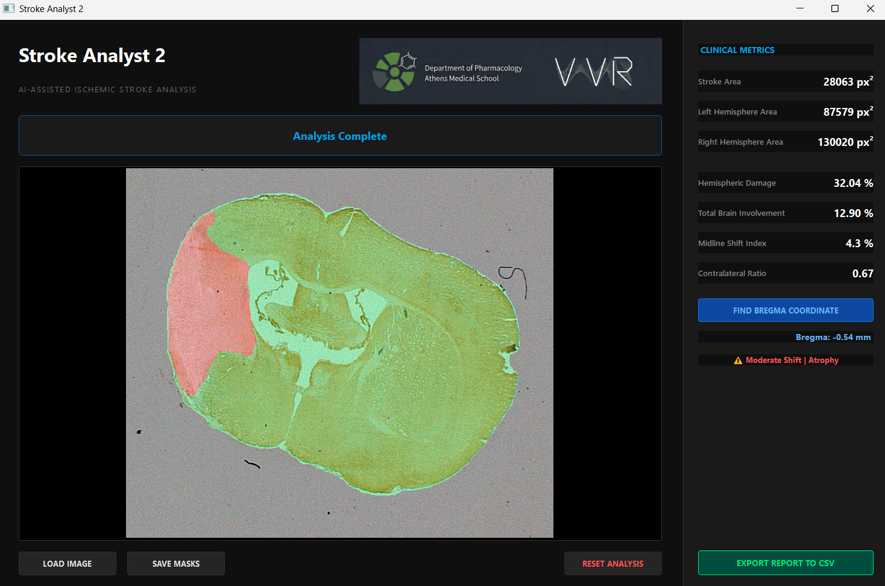

# Stroke Analyst 2
**Deep-Learning-Network Analysis of Stroke on Brain Sections**


> ⚠️ **Notice: Under Review**
> The source code and executable for **Stroke Analyst 2** are currently under review for presentation at the **European Stroke Organisation Conference (ESOC) 2026**. The repository will be populated with the release version following the conference.

## 📋 Overview
**Stroke Analyst 2 (SA2)** is a standalone desktop application designed to streamline the quantification of ischemic stroke in rodent brain sections.

This advanced deep-learning iteration integrates a **Visual Transformer (ViT)** network—specifically the **Segment Anything Model**—to automate the tedious aspects of histological analysis. The tool is designed to be **unbiased, fast, and staining-independent**, supporting TTC, Nissl, and MAP2 datasets.

### Key Capabilities
* **Automated Preprocessing:** Performs automatic Background Segmentation (BSG) and rotation correction.
* **Deep Learning Segmentation:** Utilizes user-defined prompts to fine-tune a ViT for Hemisphere Separation and Stroke Detection (SSG).
* **High Performance:** Processes images in approximately **2 seconds** with high segmentation accuracy (DICE coefficients up to 0.97 for BSG).
* **Edema Correction:** Automatically calculates lesion volume and hemispheric ratios, correcting for cerebral edema using the midline shift method.



---

## 🔬 Scientific Methodology

### 1. The AI Model (ViT)
Unlike traditional thresholding or hybrid ImageJ approaches which can be time-consuming or biased, SA2 employs a fine-tuned Visual Transformer (ViT). The model was trained and validated on a diverse dataset:
* **Training:** 1200 Nissl-stained sections.
* **Validation:** 77 sections across MAP2, Nissl, and TTC stainings.

### 2. Stereotaxic Coordinate System
The software utilizes a custom coordinate calibration based on the **Allen Mouse Brain Reference Atlas (CCFv3)** to assign accurate Bregma coordinates to every slice.
* **Reference Dataset:** 509 Coronal Sections.
* **Zero-Point (Bregma 0.00 mm):** Defined anatomically by the decussation of the **Anterior Commissure (ac)**.
* **Anteroposterior (AP) Coverage:** +4.20 mm (Olfactory Bulb) to -8.80 mm (Upper Cervical Spinal Cord).
* **Calculation:** Coordinates are derived via linear spatial interpolation with a step size of **~0.0255 mm per slice**.

---

## 🚀 Availability & Usage
**The executable and source code will be released publicly in (around) May 2026.**

Upon release, the application will require **no installation or coding knowledge**:
1.  **Download** the generic executable.
2.  **Drag & Drop** your raw histological image.
3.  **Draw** a prompt box around the brain to initiate the ViT.
4.  **Export** automated reports (CSV) and mask overlays.

---

## 📂 Project Structure
```text
StrokeAnalyst2/
├── stroke_analyst_2.py    # Main application logic
├── atlas_data/            # 509 calibrated atlas slices (CCFv3)
├── test_images/           # Sample TTC/Nissl data
├── models/                # Fine-tuned ViT weights
└── dist/                  # Compiled Executable (Coming Soon)

---

## 📚 Acknowledgements

- Allen Institute for Brain Science (2017). Allen Mouse Brain Atlas (CCFv3).
- Paxinos & Franklin. The Mouse Brain in Stereotaxic Coordinates, 5th Edition.

---

## 📄 License

Academic and research use only. Commercial use is prohibited without permission.

